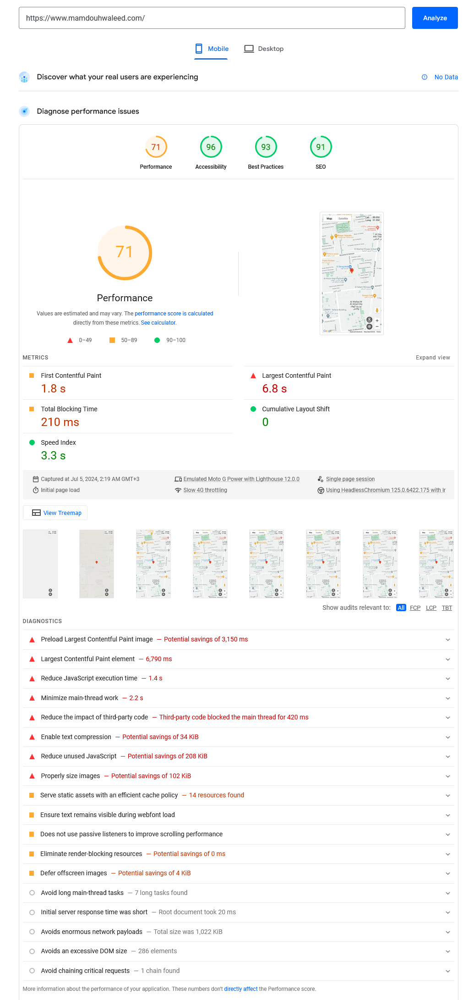

# Performance

Used Chrome Lighthouse to measure performance of the website, mainly on mobile
Lighthouse advantages:

1. Imitates performance on a slower device by simulating a throttled CPU
2. Emulates a throttled 4G Network connection for mobile
   Chrome Lighthouse also provides suggestions for improving accessibility, using best practices and improving SEO, so I usually run Chrome Lighthouse tests during development to fix any of these issues.

