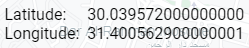
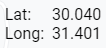

# Implementation Strategies

## Project Structure

Followed Sveltekit's conventions as per their documentation.

## Rendering

Since this is a static application, I disabled Server Side Rendering and enabled Prerender.

## Data Storage

Used localStorage to store the pin location.
Add functionality to data stores to automatically update localStorage whenever the pin location changes.

## Responsiveness

It was required that the final application would run on both mobile and computer devices, so I used the "Toggle device toolbar" button from Chrome DevTools 

Used mediaquery to modify the appearance of the Latitude and Longitude on the top right part of the page.

| Desktop                                            | Mobile                                             |
| -------------------------------------------------- | -------------------------------------------------- |
|  |  |
